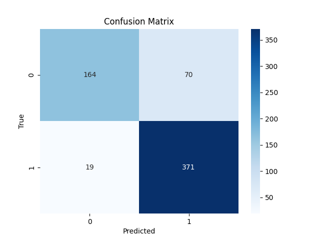

# Task 1 – CNN-Based Pneumonia Classification with Comprehensive Analysis

## 1. Introduction

Early detection of pneumonia from chest X-rays is a critical clinical task. Automated AI-based systems can support radiologists by providing rapid triage and diagnostic assistance. In this study, we develop and evaluate convolutional neural network (CNN) models for binary classification of chest X-ray images (Normal vs Pneumonia) using the PneumoniaMNIST dataset from MedMNIST v2.

The objective is not only to achieve high classification accuracy, but to conduct a rigorous experimental evaluation including model comparison, error analysis, and interpretation of results in a medical AI context.

---

## 2. Dataset Description

We use the PneumoniaMNIST dataset (MedMNIST v2):

- Task: Binary classification (Normal vs Pneumonia)
- Training set: ~4,700 images
- Validation set: ~500 images
- Test set: ~600 images
- Image resolution: 28×28 grayscale

Due to the low resolution, careful architectural design and preprocessing decisions are necessary.

---

## 3. Methodology

### 3.1 Data Preprocessing

Two preprocessing pipelines were used:

#### For SimpleCNN:
- RandomRotation(±10°)
- Normalization (mean=0.5, std=0.5)

#### For ResNet18:
- Resize to 224×224
- Grayscale → 3 channels
- RandomRotation(±10°)
- ImageNet normalization

Horizontal flipping was intentionally avoided to preserve anatomical consistency.

---

### 3.2 Model Architectures

#### 3.2.1 SimpleCNN (Custom Baseline)

A lightweight CNN designed specifically for 28×28 grayscale input:

- Conv(1→32) + ReLU + MaxPool
- Conv(32→64) + ReLU + MaxPool
- Fully connected (128 units)
- Dropout (0.3)
- Output layer (2 classes)

This model learns features directly at native image resolution.

---

#### 3.2.2 ResNet18 (Transfer Learning)

We used a pretrained ResNet18 model (ImageNet weights):

- Backbone frozen
- Final fully connected layer replaced (2 outputs)
- Input resized to 224×224

This setup evaluates the effectiveness of transfer learning from natural images to medical X-rays.

---

### 3.3 Training Configuration

- Loss: CrossEntropyLoss
- Optimizer: Adam
- Learning rate: 1e-4
- LR Scheduler: StepLR (gamma=0.5 every 5 epochs)
- Epochs: 15
- Hardware: NVIDIA 2GB GPU

Model selection was based on validation loss.

---

## 4. Evaluation Metrics

We report:

- Accuracy
- Precision
- Recall (Sensitivity)
- F1-score
- Area Under ROC Curve (AUC)

AUC is particularly important in medical diagnosis as it measures discriminative ability across thresholds.

---

## 5. Experimental Results

### 5.1 Quantitative Comparison

| Metric      | SimpleCNN | ResNet18 |
|------------|-----------|----------|
| Accuracy   | 0.8478    | 0.8301   |
| Precision  | 0.8105    | 0.8184   |
| Recall     | 0.9872    | 0.9359   |
| F1-score   | 0.8902    | 0.8732   |
| AUC        | 0.9208    | 0.9190   |

---

### 5.2 Observations

1. The custom SimpleCNN slightly outperformed ResNet18 in accuracy and AUC.
2. ResNet18 showed marginally higher precision.
3. SimpleCNN achieved extremely high recall (0.9872), minimizing false negatives.
4. Both models achieved comparable AUC (~0.92), indicating strong discriminative performance.

---

## 6. Error Analysis

### 6.1 Confusion Matrix

(Insert confusion matrix figure here)

The models demonstrate strong sensitivity but some false positives remain.

### 6.2 Failure Case Analysis

Common patterns observed in misclassified samples:

- Low contrast X-rays
- Subtle pneumonia features
- Borderline cases with ambiguous patterns

These cases may reflect intrinsic ambiguity even for human experts.

---

## 7. Discussion

### 7.1 Why Did SimpleCNN Outperform ResNet18?

Several factors may explain this:

1. **Resolution Mismatch**
   - Original images are 28×28.
   - Resizing to 224×224 introduces interpolation artifacts.

2. **Domain Shift**
   - ResNet18 pretrained on ImageNet (natural RGB images).
   - Chest X-rays have different texture distributions.

3. **Small Dataset Size**
   - Limited training samples reduce benefit of large pretrained features.

This suggests that for low-resolution medical datasets, carefully designed lightweight CNNs may outperform large pretrained architectures.

---

### 7.2 Clinical Relevance

High recall (sensitivity) is critical in pneumonia detection. Missing pneumonia (false negatives) can lead to severe consequences. Both models demonstrate strong sensitivity, making them suitable for screening applications.

---

## 8. Limitations

- Low image resolution (28×28)
- No external validation dataset
- No fine-tuning of deeper ResNet layers
- No explainability methods (e.g., Grad-CAM)

---

## 9. Future Work

- Fine-tuning last ResNet blocks
- Using medical-specific pretrained models
- Applying attention mechanisms
- Incorporating explainability techniques
- Evaluating calibration and uncertainty estimation

---

## 10. Conclusion

We developed and rigorously evaluated CNN-based models for pneumonia detection. Surprisingly, a lightweight custom CNN slightly outperformed a pretrained ResNet18 model. This highlights the importance of architectural alignment with dataset characteristics and careful experimental validation in medical AI systems.

Both models achieved strong AUC (~0.92) and high sensitivity, demonstrating their potential utility in automated pneumonia screening systems.
