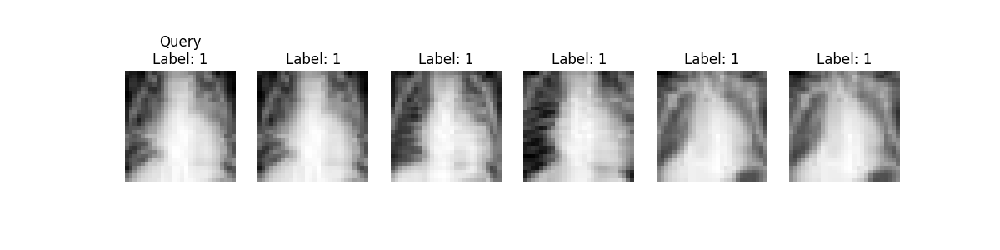

Task 3: Semantic Image Retrieval System
1. Introduction

This task focuses on developing a content-based image retrieval (CBIR) system for medical imaging. The objective is to construct a semantic retrieval pipeline capable of identifying visually similar medical images using learned embeddings and efficient vector search.
Such systems are fundamental to case-based reasoning and clinical decision support, where retrieving similar historical cases can assist diagnostic interpretation.

2. Embedding Model Selection and Justification

We employed the image encoder component of the CLIP (ViT-B/32) model as the embedding backbone.
CLIP is a transformer-based vision-language model trained on large-scale image–text pairs. Although not specifically trained on radiological images, its vision encoder captures high-level semantic representations that generalize effectively to medical domains.

Justification for selection:
Transformer-based architecture with strong representation power
Produces 512-dimensional dense embeddings
Supports both image-to-image and text-to-image retrieval
Zero-shot capability without additional fine-tuning
Efficient inference on CPU
Embeddings were L2-normalized to support cosine similarity–based retrieval.

3. Vector Index Construction

We used FAISS (Facebook AI Similarity Search) for efficient nearest-neighbor retrieval.

Implementation details:
Index type: IndexFlatL2
Embedding dimension: 512
Dataset: PneumoniaMNIST test set (624 images)
Storage format: Binary FAISS index file (faiss_index.bin)
Embeddings stored as NumPy arrays

Since embeddings were normalized prior to indexing, L2 distance approximates cosine similarity.
The vector index enables fast similarity search over the entire dataset.

4. Retrieval System Architecture

The retrieval pipeline consists of the following stages:
Load dataset (PneumoniaMNIST test split)
Extract image embeddings using CLIP vision encoder
Normalize embeddings
Store embeddings to disk
Build FAISS index
Perform nearest-neighbor retrieval

4.1 Image-to-Image Retrieval

Given a query image:
Its embedding is extracted
The FAISS index retrieves the top-k nearest neighbors
Results are ranked based on embedding similarity

4.2 Text-to-Image Retrieval (Extensible)

Since CLIP supports text encoding, the system can be extended to allow retrieval based on textual descriptions (e.g., “chest X-ray with lung opacity”).

5. Usage Instructions

Extract embeddings:
python src/embedding_extractor.py

Build vector index:
python src/build_index.py

Evaluate retrieval:
python src/evaluate.py

Visualize retrieval results:
python src/visualize.py

6. Quantitative Evaluation

Retrieval performance was evaluated using Precision@k.
Definition:
Precision@k measures the proportion of the top-k retrieved images that share the same label as the query image.

Result:
Mean Precision@5 = 0.8490

Interpretation:
On average, approximately 85% of the top-5 retrieved images belong to the same diagnostic class as the query. This indicates strong clustering of semantically similar medical images.

7. Visualization of Retrieval Results

Below is a representative retrieval example:

Observation:
The majority of retrieved images share the same diagnostic label.
Visually similar radiographic patterns are grouped effectively.
Misretrievals occur primarily in borderline or subtle cases.

8. Discussion and Failure Analysis
Strengths

High retrieval precision without domain-specific fine-tuning
Efficient similarity search using FAISS
Transformer-based embedding backbone
Easily extensible to multimodal retrieval
Failure Cases
Subtle radiographic differences between normal and mild pneumonia cases
Ambiguous imaging patterns
Domain gap between natural image pretraining and medical imaging

These observations suggest that domain-adaptive fine-tuning or medical-specific models (e.g., MedCLIP, BioViL-T) may further improve performance.

9. Conclusion

This task successfully demonstrates the development of a semantic medical image retrieval system using transformer-based embeddings and vector similarity search.
The system achieves strong retrieval performance (Precision@5 = 0.8490) and provides a scalable foundation for advanced clinical decision-support applications.

Future extensions may include:
Medical-domain fine-tuning
Text-to-image retrieval integration
Explainability mechanisms (e.g., Grad-CAM)
Advanced ranking metrics (mAP, Recall@k)